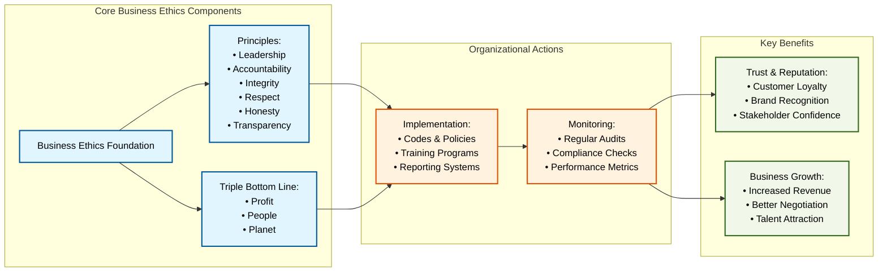

<h1>⚠️ Warning</h1>AI Generated Content

Business ethics represents the moral principles, policies, and values that govern how companies operate and engage in business activities 0:2. It encompasses the standards and codes of conduct that drive employee behavior at all levels and foster trust between businesses and their stakeholders.

### Core Components of Business Ethics

1. **Foundational Principles**  - Leadership
  - Accountability
  - Integrity
  - Respect for others
  - Honesty
  - Respect for laws
  - Transparency
  - Compassion
  - Fairness
  - Loyalty
  - Environmental concern 0:6

2. **Triple Bottom Line Approach**

        Companies focus on three key areas:
          - Profit: Financial returns for shareholders
  - People: Impact on customers, employees, and stakeholders
  - Planet: Environmental impact and sustainability 1:4

### Actions Organizations Take to Improve Business Ethics

1. **Implementation Framework**  - Create comprehensive codes of conduct and ethics guidelines
  - Establish clear reporting procedures
  - Develop training programs for employees
  - Set up continuous communication channels 0:14

2. **Leadership Commitment**  - Demonstrate ethical behavior from top management
  - Communicate importance of ethics throughout organization
  - Provide necessary resources for ethical practices
  - Lead by example in decision-making processes 2:6

3. **Employee Engagement**  - Regular ethics training sessions
  - Clear communication about expectations
  - Safe channels for reporting concerns
  - Protection for whistleblowers
  - Recognition for ethical behavior 2:9

4. **Stakeholder Management**  - Regular engagement with stakeholders
  - Transparent communication about policies
  - Inclusive decision-making processes
  - Feedback mechanisms for improvement 2:8

5. **Compliance and Monitoring**  - Regular audits and assessments
  - Performance metrics tracking
  - Continuous policy updates
  - Enforcement mechanisms
  - Anonymous reporting systems 0:15

### Benefits of Strong Business Ethics

1. **Enhanced Reputation**  - Improved brand recognition
  - Increased trust among customers
  - Better stakeholder relationships
  - Competitive advantage in market 0:7

2. **Financial Advantages**  - Reduced legal risks
  - Lower operational costs
  - Increased revenue potential
  - Attracting long-term investors 0:10

3. **Workplace Improvements**  - Higher employee morale
  - Better retention rates
  - More attractive to talent
  - Positive work environment 2:4

Organizations that prioritize business ethics experience sustainable growth and success while maintaining positive relationships with their stakeholders. The implementation of strong ethical practices requires consistent effort and commitment from leadership, but the benefits extend well beyond compliance, contributing to long-term organizational prosperity and societal impact.