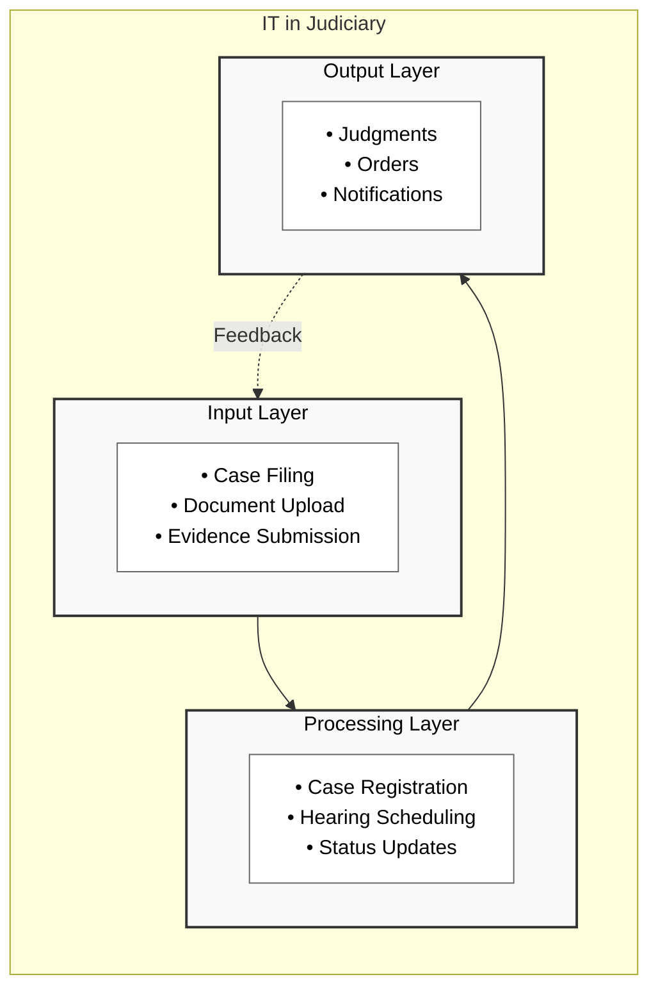

<h1>⚠️ Warning</h1>AI Generated Content

### a. IT in Judiciary

The integration of Information Technology in judicial systems represents a significant transformation in legal administration, bringing efficiency and transparency to court operations.

The diagram above illustrates the three-layer architecture of IT in Judiciary, with each layer building upon the previous one. The solid arrows show the sequential progression, while the dotted line represents the continuous feedback loop that helps improve input processes based on output results.

Key components include:

- **Case Management**  - Electronic filing systems
  - Digital document storage
  - Automated case tracking

- **Court Operations**  - Hearing scheduling
  - Judge allocation
  - Courtroom management

- **Information Access**  - Public access portals
  - Case status tracking
  - Judgment database

- **Security Measures**  - Access control
  - Data encryption
  - Audit trails

### b. e-payment

Electronic payment systems represent a crucial component of digital governance, enabling secure and efficient financial transactions.

<pre class="mermaid">
flowchart TD
    subgraph EP["e-Payment System"]
        direction TB
        
        subgraph User["User Layer"]
            U1["• Authentication
            • Account Selection
            • Amount Entry"]
        end
        
        subgraph Process["Processing Layer"]
            P1["• Transaction Validation
            • Security Check
            • Payment Processing"]
        end
        
        subgraph Bank["Bank Layer"]
            B1["• Account Verification
            • Fund Transfer
            • Transaction Update"]
        end
        
        User --> Process
        Process --> Bank
        Bank -.->|Confirmation| User
        
        classDef layer fill:#f9f9f9,stroke:#333,stroke-width:2px,color:#000000
        classDef comp fill:#ffffff,stroke:#666,color:#000000
        
        class User,Process,Bank layer
        class U1,P1,B1 comp
    end
</pre>

The diagram above illustrates the three-layer architecture of e-payment systems, with each layer handling specific aspects of the transaction process. The solid arrows show the sequential flow of transactions, while the dotted line represents the confirmation feedback loop that completes the payment cycle.

Key components include:

- **Payment Gateway**  - Transaction processing
  - Security protocols
  - Multiple payment options

- **User Interface**  - Mobile accessibility
  - Payment history
  - Transaction tracking

- **Security Features**  - Two-factor authentication
  - Encryption
  - Fraud detection

- **Reporting System**  - Transaction records
  - Payment analytics
  - Compliance reporting
